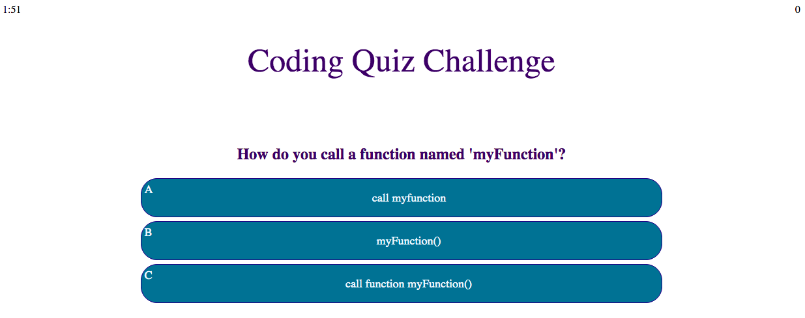

# Code-quiz

This project uses Javascript to create an interactive quiz and included the following features:

- a timer that starts on a start button
- questions appear and allow a user to click on the chosen answer
- a score is kept in the corner
- the game ends when there are no more questions or the time runs out
- when the game is over, the user can store their score and their initials
- the score will be stores in localStorage so high scores can be displayed

## Link

https://barbarashea.github.io/code-quiz/

## Site Preview

